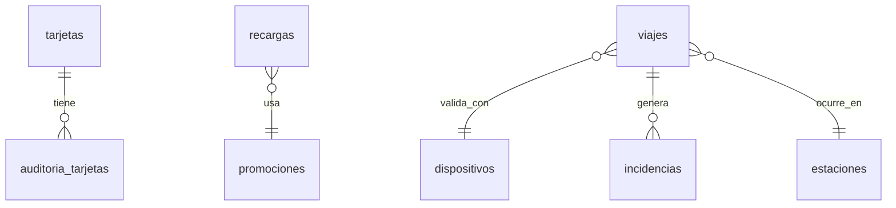

<h1 style="display: inline;">Proyecto Final – Sistema de Recargas y Viajes
 </h1>

Este repositorio contiene la implementación de las mejoras al sistema de base de datos `sistema_recargas_viajes`, desarrolladas como parte del proyecto final de la asignatura **Programación de Bases de Datos**.

## 📋 Tabla de Contenido

- [📌 Funcionalidades implementadas](#-funcionalidades-implementadas)
- [🛠️ Instrucciones para ejecutar los scripts](#️-instrucciones-para-ejecutar-los-scripts)
- [📐 Diagrama ER (cambios estructurales)](#-diagrama-er-cambios-estructurales)
- [🧾 Tablas modificadas o creadas](#-tablas-modificadas-o-creadas)
- [🗂️ Tipo de datos insertados](#️-tipo-de-datos-insertados)
- [📋 Consultas desarrolladas](#-consultas-desarrolladas)
- [🔐 Credenciales (base de datos de pruebas)](#-credenciales-base-de-datos-de-pruebas)
- [✅ Conclusiones](#-conclusiones)
- [🛠️ Recomendaciones](#️-recomendaciones)
- [👥 Desarrolladores](#-desarrolladores)

---

## 📌 Funcionalidades implementadas

1. **Auditoría del estado de tarjetas**
   - Se creó una tabla de auditoría para registrar cada vez que una tarjeta cambia de estado.
   - Se implementó un `TRIGGER` que automatiza este registro.

2. **Promociones aplicadas en recargas**
   - Se añadió la capacidad de asociar promociones o descuentos a las recargas.
   - Se pueden consultar las promociones aplicadas y analizar su uso.

3. **Registro de dispositivos de validación**
   - Se incluyó el uso de dispositivos (torniquetes, móviles, etc.) para validar los viajes.
   - Se relacionaron los viajes con los dispositivos y se permite hacer seguimiento por tipo.

4. **Mejora adicional: Registro de incidencias**
   - Se propuso e implementó una nueva tabla para reportar incidencias durante los viajes.
   - Permite clasificar las incidencias por gravedad y analizar su frecuencia por estación o tipo de dispositivo.

---

## 🛠️ Instrucciones para ejecutar los scripts

1. **Crear una copia de la base de datos original:**
   ```sql
   CREATE DATABASE sistema_recargas_viajes__grupoddj TEMPLATE sistema_recargas_viajes_base;
   \c sistema_recargas_viajes__grupoddj
   ```

2. **Ejecutar los scripts en el siguiente orden:**
   - `01_modificaciones.sql` – Alteraciones a tablas existentes.
   - `02_creacion_tablas.sql` – Nuevas tablas (auditoría, promociones, dispositivos, incidencias).
   - `03_insertar_datos.sql` – Inserción de registros de prueba (más de 100).
   - `04_consultas.sql` – Consultas requeridas por el proyecto.

## 📐 Diagrama ER (cambios estructurales)



## 🧾 Tablas modificadas o creadas

| Tabla | Propósito | Campos clave |
|-------|-----------|-------------|
| `auditoria_tarjetas` | Registro de cambios de estado en tarjetas | `auditoria_id`, `tarjeta_id` |
| `promociones` | Almacena promociones aplicadas a recargas | `promocion_id` |
| `dispositivos` | Registra los dispositivos que validan viajes | `dispositivo_id` |
| `incidencias` | Incidentes reportados durante viajes | `incidencia_id`, `viaje_id` |

## 🗂️ Tipo de datos insertados

Se insertaron más de 100 registros entre tarjetas, recargas, promociones, dispositivos y viajes para validar correctamente todas las funcionalidades. En las incidencias se simularon diferentes niveles de gravedad (leve, media, alta) y su asociación con estaciones y dispositivos móviles.

## 📋 Consultas desarrolladas

- Cambios de estado de tarjetas por mes y tarjetas con más cambios
- Recargas por promoción y monto recargado por tipo de promoción
- Viajes sin validación y validaciones con dispositivos móviles en abril
- Dispositivo con más validaciones
- Total de incidencias por gravedad
- Incidencias por estación y por tipo de dispositivo (con JOIN)

## 🔐 Credenciales (base de datos de pruebas)

- **Host:** 149.130.169.172
- **User:** admin
- **Pass:** Pass!__2025!
- **Port:** 33333
- **DB:** sistema_recargas_viajes

## ✅ Conclusiones

- El desarrollo de este proyecto permitió aplicar de manera práctica los conocimientos adquiridos en el curso de Programación de Bases de Datos, integrando conceptos como diseño de tablas, claves foráneas, funciones, triggers y consultas SQL avanzadas.
- La implementación de mejoras como la auditoría de tarjetas, el registro de dispositivos y la gestión de incidencias, demostró cómo una base de datos puede evolucionar para responder a nuevas necesidades del sistema.
- El trabajo colaborativo fue fundamental para el éxito del proyecto, permitiendo dividir tareas, resolver dudas en equipo y lograr una entrega bien estructurada tanto a nivel técnico como documental.

## 🛠️ Recomendaciones

- Para futuras versiones del sistema, se recomienda integrar mecanismos de seguridad y validación de datos más robustos, especialmente en la entrada de incidencias y promociones.
- También sería útil desarrollar vistas y procedimientos almacenados que faciliten la administración y análisis de los datos sin necesidad de escribir consultas complejas manualmente.
- Por último, se sugiere complementar este sistema con una interfaz gráfica o aplicación web que consuma los datos y permita una interacción más intuitiva por parte de los usuarios finales o administrativos.

## 👥 Desarrolladores

Este proyecto fue desarrollado por **Dafne Julieth Cortés Sarmiento**, **Johana Jazmín Saavedra Tafur** y **David Stiven Silva Velandia**, estudiantes de tercer semestre del programa **Técnica Profesional en Programación de Aplicaciones de Software** de la **Fundación Universitaria Compensar**.

Como equipo, tuvimos una participación activa en la **creación de estructuras de base de datos**, **implementación de mejoras funcionales**, **desarrollo de consultas SQL**, así como en la **documentación técnica y presentación del proyecto final**. Este trabajo refleja los conocimientos adquiridos durante el curso de **Programación de Bases de Datos** y nuestro compromiso con el aprendizaje y la calidad en el desarrollo de soluciones reales.

<div align="center">

<table>
  <tr>
    <td align="center">
      <br/>
      <strong>Dafne Cortés</strong>
    </td>
    <td align="center">
      <br/>
      <strong>Johana Saavedra</strong>
    </td>
    <td align="center">
      <br/>
      <strong>David Silva</strong>
    </td>
  </tr>
</table>

<p><em>Fundación Universitaria UCompensar – 2025</em></p>

</div>
