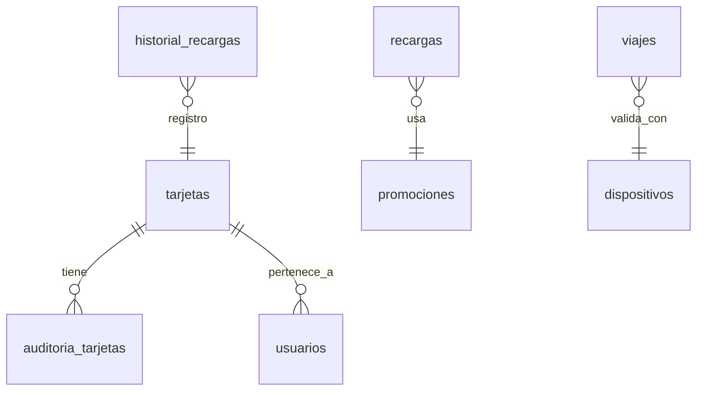

<h1 style="display: inline;">Proyecto Final – Sistema de Recargas y Viajes
 </h1>

Este repositorio contiene la implementación de las mejoras al sistema de base de datos `sistema_recargas_viajes`, desarrolladas como parte del proyecto final de la asignatura **Programación de Bases de Datos**.

## 📋 Tabla de Contenido

- [📌 Funcionalidades implementadas](#-funcionalidades-implementadas)
- [🛠️ Instrucciones para ejecutar los scripts](#️-instrucciones-para-ejecutar-los-scripts)
- [📐 Diagrama ER (cambios estructurales)](#-diagrama-er-cambios-estructurales)
- [🧾 Tablas modificadas o creadas](#-tablas-modificadas-o-creadas)
- [🗂️ Tipo de datos insertados](#️-tipo-de-datos-insertados)
- [📋 Consultas desarrolladas](#-consultas-desarrolladas)
- [✅ Conclusiones](#-conclusiones)
- [🛠️ Recomendaciones](#️-recomendaciones)
- [👥 Desarrolladores](#-desarrolladores)

---

## 📌 Funcionalidades implementadas

1. **Auditoría del estado de tarjetas**
   - Se creó una tabla de auditoría para registrar cada vez que una tarjeta cambia de estado.
   - Se implementó un `TRIGGER` que automatiza este registro.

2. **Promociones aplicadas en recargas**
   - Se añadió la capacidad de asociar promociones o descuentos a las recargas.
   - Se pueden consultar las promociones aplicadas y analizar su uso.

3. **Registro de dispositivos de validación**
   - Se incluyó el uso de dispositivos (torniquetes, móviles, etc.) para validar los viajes.
   - Se relacionaron los viajes con los dispositivos y se permite hacer seguimiento por tipo.

4. **Mejora adicional: Historial de recargas por tarjeta**
   - Se implementó una nueva funcionalidad que permite llevar un historial detallado de las recargas realizadas por cada tarjeta, incluyendo el monto, la fecha y el medio de pago.
   - Se creó una tabla `usuarios` para asociar cada tarjeta a un usuario, lo cual permite consultas más personalizadas y análisis más completos.
   - Esta mejora aporta valor al sistema al facilitar la trazabilidad de recargas, identificar usuarios frecuentes y evaluar los medios de pago más utilizados.

[⬆️ Volver a la tabla de contenido](#-tabla-de-contenido)

---

## 🛠️ Instrucciones para ejecutar los scripts

1. **Crear una copia de la base de datos original:**
   ```sql
   CREATE DATABASE sistema_recargas_viajes__grupoddj TEMPLATE sistema_recargas_viajes_base;
   \c sistema_recargas_viajes__grupoddj
   ```

2. **Ejecutar los scripts en el siguiente orden:**
   - `01_modificaciones.sql` – Alteraciones a tablas existentes.
   - `02_creacion_tablas.sql` – Nuevas tablas (auditoría, promociones, dispositivos, incidencias).
   - `03_insertar_datos.sql` – Inserción de registros de prueba (más de 100).
   - `04_consultas.sql` – Consultas requeridas por el proyecto.

[⬆️ Volver a la tabla de contenido](#-tabla-de-contenido)

---

## 📐 Diagrama ER (cambios estructurales)



[⬆️ Volver a la tabla de contenido](#-tabla-de-contenido)

---

## 🧾 Tablas modificadas o creadas

| Tabla | Propósito | Campos clave |
|-------|-----------|-------------|
| `auditoria_tarjetas` | Registro de cambios de estado en tarjetas | `auditoria_id`, `tarjeta_id` |
| `promociones` | Almacena promociones aplicadas a recargas | `promocion_id` |
| `dispositivos` | Registra los dispositivos que validan viajes | `dispositivo_id` |
| `usuarios` | Representa a los dueños de tarjetas | `usuario_id` |
| `historial_recargas` | Almacena recargas históricas con fecha y medio de pago | `historial_id`, `tarjeta_id` |

[⬆️ Volver a la tabla de contenido](#-tabla-de-contenido)

## 🗂️ Tipo de datos insertados

Se insertaron más de 100 registros en cada tabla creada o modificada:
* 100 usuarios simulados
* 100 tarjetas asociadas a usuarios
* 100 registros de historial de recargas
* 100 recargas con promociones
* 100 dispositivos y viajes simulados para análisis

Esto permite validar correctamente las funcionalidades y consultas desarrolladas.

[⬆️ Volver a la tabla de contenido](#-tabla-de-contenido)

---

## 📋 Consultas desarrolladas

- Cambios de estado de tarjetas por mes y tarjetas con más cambios
- Recargas por promoción y monto recargado por tipo de promoción
- Viajes sin validación y validaciones con dispositivos móviles en abril
- Dispositivo con más validaciones
- Total recargado por tarjeta en el último mes
- Medios de pago más usados y su promedio
- Historial de recargas con nombre del usuario (JOIN con tarjetas y usuarios)

[⬆️ Volver a la tabla de contenido](#-tabla-de-contenido)

---

## ✅ Conclusiones

- La implementación del historial de recargas por tarjeta permitió ampliar las capacidades del sistema, brindando una visión más detallada del comportamiento de los usuarios y su relación con las recargas realizadas.
- Al vincular las tarjetas con una tabla de usuarios, se logró simular un entorno más cercano a un sistema real, facilitando consultas más ricas y análisis personalizados.
- El desarrollo de esta mejora implicó no solo la creación de nuevas estructuras, sino también la actualización de tablas existentes, el uso de claves foráneas y la ejecución de consultas con múltiples JOIN, lo cual consolidó el aprendizaje de relaciones entre entidades en bases de datos relacionales.

[⬆️ Volver a la tabla de contenido](#-tabla-de-contenido)

---

## 🛠️ Recomendaciones

- Para futuras versiones del sistema, se recomienda crear procedimientos almacenados que automaticen el registro del historial de recargas desde el momento en que se realice una transacción en la tabla principal recargas.
- También sería útil agregar campos adicionales como ubicación de recarga o canal (terminal, web, app) para enriquecer el análisis de uso del sistema.
- Finalmente, se sugiere integrar estos datos con herramientas de visualización o reportes automáticos que permitan a los administradores del sistema obtener información útil de manera rápida y clara.

[⬆️ Volver a la tabla de contenido](#-tabla-de-contenido)

---

## 👥 Desarrolladores
[⬆️ Volver a la tabla de contenido](#-tabla-de-contenido)

Este proyecto fue desarrollado por **Dafne Julieth Cortés Sarmiento**, **Johana Jazmín Saavedra Tafur** y **David Stiven Silva Velandia**, estudiantes de tercer semestre del programa **Técnica Profesional en Programación de Aplicaciones de Software** de la **Fundación Universitaria Compensar**.

Como equipo, tuvimos una participación activa en la **creación de estructuras de base de datos**, **implementación de mejoras funcionales**, **desarrollo de consultas SQL**, así como en la **documentación técnica y presentación del proyecto final**. Este trabajo refleja los conocimientos adquiridos durante el curso de **Programación de Bases de Datos** y nuestro compromiso con el aprendizaje y la calidad en el desarrollo de soluciones reales.

<div align="center">

<table>
  <tr>
    <td align="center">
      <br/>
      <strong>Dafne Cortés</strong>
    </td>
    <td align="center">
      <br/>
      <strong>Johana Saavedra</strong>
    </td>
    <td align="center">
      <br/>
      <strong>David Silva</strong>
    </td>
  </tr>
</table>

</div>
